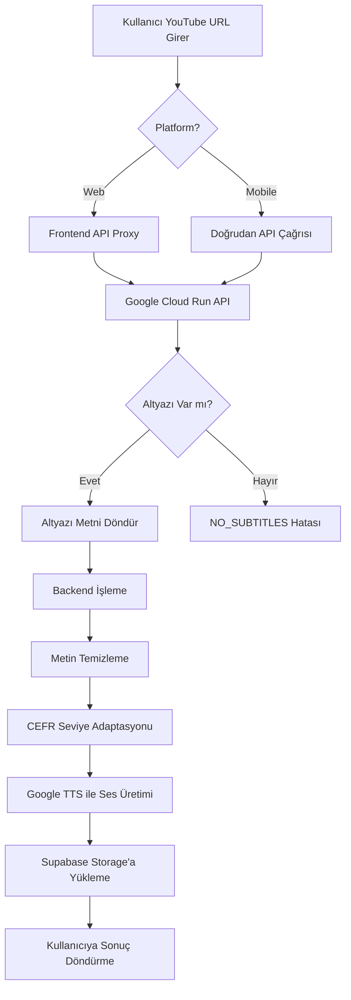
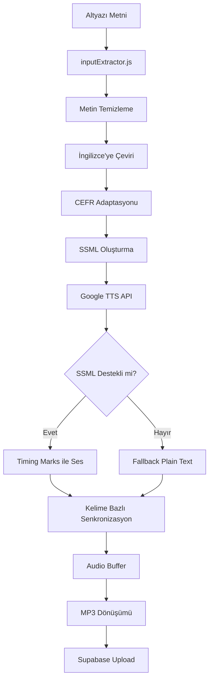

# YouTube Altyazı Sistemi - Teknik Analiz Dokümanı

## 📋 Genel Bakış

LingRoot platformu, YouTube videolarından altyazı çekmek için **iki farklı yaklaşım** kullanmaktadır:

1. **Google Cloud Run Tabanlı API** (Üretim - Production)
2. **Yerel Playwright/FastAPI Servisi** (Geliştirme - Development)

---

## 🏗️ Mimari Yapı

### 1. Google Cloud Run API (Üretim Ortamı)

#### **Endpoint URL:**
```
https://yt-subtitle-api-na5bfjgtjq-ew.a.run.app/api/subtitle
```

#### **Kullanım Yerleri:**
- **Mobile App:** `/Users/enesyuzak/Documents/GitHub/LingRoot/Main/LingRootMobile/src/screens/CreateScreen.tsx` (Satır 95)
- **Web Frontend:** `/Users/enesyuzak/Documents/GitHub/LingRoot/Main/frontend/pages/api/youtube-subtitle.ts` (Satır 22)

#### **API İstek Formatı:**
```typescript
POST https://yt-subtitle-api-na5bfjgtjq-ew.a.run.app/api/subtitle
Content-Type: application/json

{
  "url": "https://www.youtube.com/watch?v=VIDEO_ID",
  "temizle": true,
  "dil": "tr"
}
```

#### **API Yanıt Formatı:**
```json
{
  "success": true,
  "text": "Altyazı metni buraya gelir..."
}
```

#### **Hata Durumları:**
```json
{
  "success": false,
  "errorCode": "NO_SUBTITLES",
  "message": "Bu videoda altyazı bulunmamaktadır"
}
```

---

### 2. Yerel Playwright/FastAPI Servisi (Geliştirme Ortamı)

#### **Servis Konumu:**
```
/Users/enesyuzak/Documents/GitHub/LingRoot/Main/backend/youtubetranscriptservice/main.py
```

#### **Endpoint:**
```
http://localhost:8000/scrape-transcript
```

#### **Teknoloji Stack:**
- **Framework:** FastAPI (Python)
- **Web Scraping:** Playwright
- **Kaynak Site:** https://youtubetotranscript.com

#### **API Yapısı:**

**Endpoints:**
1. `POST /scrape-transcript` - Altyazı çekme
2. `GET /health` - Servis sağlık kontrolü
3. `OPTIONS /scrape-transcript` - CORS desteği

**İstek Formatı:**
```python
{
  "url": "https://www.youtube.com/watch?v=VIDEO_ID",
  "language_code": "en"  # Varsayılan: "en"
}
```

**Yanıt Formatı:**
```python
{
  "transcript": "Video altyazı metni...",
  "success": True
}
```

**Hata Durumunda Fallback:**
```python
{
  "transcript": "HATA: [Hata mesajı]\n\nBu bir fallback transkript örneğidir...",
  "success": False,
  "error": "Hata detayı"
}
```

---

## 🔧 Google Cloud Servisleri Kullanımı

### 1. **Google Cloud Run**

#### **Kullanım Amacı:**
YouTube altyazı API'sini serverless olarak host etmek

#### **Özellikler:**
- **Bölge:** Europe-West (ew)
- **URL Pattern:** `https://[SERVICE-NAME]-[HASH]-ew.a.run.app`
- **Servis Adı:** `yt-subtitle-api`
- **Auto-scaling:** Otomatik ölçeklendirme
- **Pricing Model:** Pay-per-use (kullanım başına ödeme)

#### **Avantajlar:**
- ✅ Otomatik ölçeklendirme
- ✅ Yüksek erişilebilirlik
- ✅ Düşük maliyet (kullanılmadığında ücret yok)
- ✅ HTTPS otomatik sağlanır
- ✅ Global CDN desteği

---

### 2. **Google Cloud Text-to-Speech API**

#### **Kullanım Amacı:**
Metin içeriğini yüksek kaliteli sesli içeriğe dönüştürmek

#### **Paket:**
```json
"@google-cloud/text-to-speech": "^5.3.0"
```

#### **Kullanım Yeri:**
`/Users/enesyuzak/Documents/GitHub/LingRoot/Main/backend/utils/googleTTS.js`

#### **Yapılandırma:**
```javascript
const ttsClient = new textToSpeech.TextToSpeechClient({
  projectId: process.env.GOOGLE_CLOUD_PROJECT_ID,
  keyFilename: process.env.GOOGLE_APPLICATION_CREDENTIALS
});
```

#### **Desteklenen Ses Tipleri:**
- **Standard:** Temel kalite sesler
- **Wavenet:** Premium doğal sesler
- **Neural2:** Gelişmiş AI sesleri
- **Journey:** Premium paket
- **Chirp:** Gold paket
- **Studio:** Platinum paket

#### **Özellikler:**
- ✅ SSML (Speech Synthesis Markup Language) desteği
- ✅ Kelime bazlı timing marks
- ✅ Çoklu dil desteği (en-US, en-GB, en-AU, en-CA, en-IN)
- ✅ Cinsiyet seçimi (MALE, FEMALE, NEUTRAL)
- ✅ Konuşma hızı ayarı (0.25x - 4.0x)
- ✅ Ses tonu ayarı (pitch)
- ✅ Ses seviyesi ayarı (volume gain)

#### **Fiyatlandırma Modeli:**
- Standard voices: Düşük maliyet
- WaveNet voices: Orta maliyet
- Neural2/Journey/Studio: Yüksek maliyet

---

## 🔄 İş Akışı (Workflow)

### YouTube Altyazı Çekme Akışı



### TTS İşleme Akışı



---

## 📁 Dosya Yapısı ve Sorumluluklar

### Backend Dosyaları

| Dosya | Sorumluluk |
|-------|-----------|
| `backend/utils/youtubeTranscriptService.js` | Yerel Playwright servisine istek gönderme |
| `backend/utils/inputExtractor.js` | YouTube URL'den metin çıkarma koordinasyonu |
| `backend/utils/googleTTS.js` | Google TTS API entegrasyonu |
| `backend/youtubetranscriptservice/main.py` | FastAPI altyazı scraping servisi |
| `backend/controllers/ttsController.js` | TTS işleme pipeline'ı |

### Frontend Dosyaları

| Dosya | Sorumluluk |
|-------|-----------|
| `frontend/pages/api/youtube-subtitle.ts` | Google Cloud Run API proxy |
| `frontend/next.config.js` | API routing yapılandırması |

### Mobile Dosyaları

| Dosya | Sorumluluk |
|-------|-----------|
| `LingRootMobile/src/screens/CreateScreen.tsx` | YouTube URL girişi ve altyazı çekme |

---

## 🔐 Ortam Değişkenleri

### Google Cloud Yapılandırması

```bash
# Google Cloud TTS
GOOGLE_CLOUD_PROJECT_ID=your-project-id
GOOGLE_APPLICATION_CREDENTIALS=/path/to/service-account-key.json

# Diğer Servisler
OPENAI_API_KEY=sk-...
SUPABASE_URL=https://your-project.supabase.co
SUPABASE_SERVICE_KEY=eyJ...
SUPABASE_BUCKET_NAME=audio-outputs
```

---

## 🚀 Deployment Yapılandırması

### Google Cloud Run Deployment

#### **Gereksinimler:**
1. Google Cloud Project
2. Cloud Run API aktif
3. Service Account ile kimlik doğrulama
4. Container Registry veya Artifact Registry

#### **Deployment Adımları:**
```bash
# 1. Docker image oluştur
docker build -t gcr.io/PROJECT_ID/yt-subtitle-api .

# 2. Image'ı push et
docker push gcr.io/PROJECT_ID/yt-subtitle-api

# 3. Cloud Run'a deploy et
gcloud run deploy yt-subtitle-api \
  --image gcr.io/PROJECT_ID/yt-subtitle-api \
  --platform managed \
  --region europe-west1 \
  --allow-unauthenticated
```

### Yerel Geliştirme Ortamı

```bash
# Python bağımlılıklarını yükle
pip install fastapi uvicorn playwright pydantic

# Playwright browser'ları yükle
python -m playwright install

# Servisi başlat
uvicorn backend.youtubetranscriptservice.main:app --host 0.0.0.0 --port 8000 --reload
```

---

## 📊 API Kullanım İstatistikleri

### Google Cloud Run Metrikleri

- **Request Count:** İstek sayısı
- **Request Latency:** İstek gecikme süresi
- **Container Instance Count:** Aktif container sayısı
- **Billable Container Time:** Faturalandırılabilir süre
- **Memory Utilization:** Bellek kullanımı
- **CPU Utilization:** CPU kullanımı

### Google TTS Metrikleri

- **Characters Processed:** İşlenen karakter sayısı
- **Audio Duration Generated:** Üretilen ses süresi
- **Voice Type Distribution:** Ses tipi dağılımı
- **API Call Count:** API çağrı sayısı
- **Error Rate:** Hata oranı

---

## 🔍 Hata Yönetimi ve Fallback Stratejileri

### YouTube Altyazı Hataları

1. **NO_SUBTITLES:** Video altyazısı yok
   - **Çözüm:** Kullanıcıya bilgi ver, alternatif içerik öner

2. **INVALID_URL:** Geçersiz YouTube URL
   - **Çözüm:** URL formatını kontrol et, kullanıcıya uyarı ver

3. **API_ERROR:** Cloud Run API hatası
   - **Çözüm:** Yerel Playwright servisine fallback

4. **TIMEOUT:** İstek zaman aşımı
   - **Çözüm:** Retry mekanizması, kullanıcıya bilgi

### Google TTS Hataları

1. **SSML_NOT_SUPPORTED:** Ses SSML desteklemiyor
   - **Çözüm:** Plain text ile fallback

2. **GENDER_NEUTRAL_ERROR:** Cinsiyet neutral hatası
   - **Çözüm:** API'den gerçek gender bilgisi al

3. **PERMISSION_DENIED:** Yetki hatası
   - **Çözüm:** Standard/Neural2 sese geç

4. **QUOTA_EXCEEDED:** Kota aşımı
   - **Çözüm:** Fallback voice kullan, kullanıcıya bilgi

---

## 💰 Maliyet Analizi

### Google Cloud Run

**Fiyatlandırma (Europe-West1):**
- CPU: $0.00002400 / vCPU-second
- Memory: $0.00000250 / GiB-second
- Requests: $0.40 / million requests
- **Free Tier:** 2 million requests/month

**Örnek Hesaplama:**
- 100,000 istek/ay
- Ortalama 2 saniye işlem süresi
- 512 MB memory
- **Tahmini Maliyet:** ~$1-2/ay

### Google Cloud Text-to-Speech

**Fiyatlandırma:**
- Standard: $4.00 / 1M characters
- WaveNet: $16.00 / 1M characters
- Neural2: $16.00 / 1M characters
- **Free Tier:** 0-4M characters/month (Standard: free, WaveNet/Neural2: $4-16)

**Örnek Hesaplama:**
- 10,000 altyazı/ay
- Ortalama 2000 karakter/altyazı
- Neural2 voice kullanımı
- **Tahmini Maliyet:** ~$320/ay

---

## 🔒 Güvenlik Önlemleri

### API Güvenliği

1. **CORS Yapılandırması:**
   ```javascript
   app.add_middleware(
       CORSMiddleware,
       allow_origins=["*"],
       allow_credentials=True,
       allow_methods=["*"],
       allow_headers=["*"],
   )
   ```

2. **Rate Limiting:** Cloud Run seviyesinde yapılandırılabilir

3. **Authentication:** Service account ile kimlik doğrulama

4. **Input Validation:** URL ve parametre doğrulama

### Veri Güvenliği

1. **Service Account Keys:** Güvenli saklama (.gitignore)
2. **Environment Variables:** Hassas bilgiler env'de
3. **HTTPS:** Tüm API çağrıları HTTPS üzerinden
4. **Logging:** Hassas bilgi loglanmaz

---

## 📈 Performans Optimizasyonları

### Google Cloud Run

1. **Min Instances:** Soğuk başlatmayı önlemek için minimum 1 instance
2. **Max Instances:** Maliyet kontrolü için maksimum limit
3. **CPU Allocation:** "CPU always allocated" seçeneği
4. **Memory:** 512MB - 2GB arası optimal

### Google TTS

1. **Chunk Processing:** Uzun metinleri parçalara böl
2. **Caching:** Sık kullanılan sesleri önbellekle
3. **Batch Processing:** Toplu işleme
4. **Optimal Voice Selection:** SSML destekli sesleri tercih et

---

## 🧪 Test Senaryoları

### YouTube Altyazı Testleri

```javascript
// Test 1: Başarılı altyazı çekme
const testUrl1 = "https://www.youtube.com/watch?v=dQw4w9WgXcQ";
// Beklenen: { success: true, text: "..." }

// Test 2: Altyazısız video
const testUrl2 = "https://www.youtube.com/watch?v=NOSUBS123";
// Beklenen: { success: false, errorCode: "NO_SUBTITLES" }

// Test 3: Geçersiz URL
const testUrl3 = "https://invalid-url.com";
// Beklenen: { success: false, error: "..." }
```

### Google TTS Testleri

```javascript
// Test 1: SSML destekli ses
const options1 = {
  text: "Hello world",
  voiceName: "en-US-Neural2-C",
  languageCode: "en-US",
  speakingRate: 1.0
};
// Beklenen: { success: true, wordTimings: [...] }

// Test 2: SSML desteksiz ses (Chirp)
const options2 = {
  text: "Hello world",
  voiceName: "en-US-Chirp-1",
  languageCode: "en-US",
  speakingRate: 1.0
};
// Beklenen: Fallback to plain text
```

---

## 📚 Referanslar ve Dokümantasyon

### Google Cloud Dokümantasyonu

1. **Cloud Run:**
   - https://cloud.google.com/run/docs

2. **Text-to-Speech API:**
   - https://cloud.google.com/text-to-speech/docs

3. **Service Accounts:**
   - https://cloud.google.com/iam/docs/service-accounts

### Kullanılan Kütüphaneler

1. **FastAPI:** https://fastapi.tiangolo.com/
2. **Playwright:** https://playwright.dev/
3. **Google Cloud Client Libraries:** https://cloud.google.com/nodejs/docs/reference

---

## 🔄 Gelecek Geliştirmeler

### Planlanan İyileştirmeler

1. **Çoklu Altyazı Dili Desteği:**
   - Kullanıcının tercih ettiği dilde altyazı çekme
   - Otomatik dil algılama

2. **Altyazı Kalite Kontrolü:**
   - OCR ile otomatik oluşturulan altyazıları filtreleme
   - Manuel altyazıları önceliklendirme

3. **Cache Mekanizması:**
   - Sık istenen videoların altyazılarını önbellekleme
   - Redis veya Cloud Memorystore kullanımı

4. **Webhook Desteği:**
   - Uzun işlemler için async processing
   - Cloud Tasks veya Cloud Pub/Sub entegrasyonu

5. **Analytics ve Monitoring:**
   - Cloud Monitoring entegrasyonu
   - Detaylı kullanım istatistikleri
   - Hata tracking (Sentry/Cloud Error Reporting)

---

## 📞 Destek ve İletişim

### Teknik Destek

- **Proje Repository:** https://github.com/aigokhankaya/LingRoot
- **Dokümantasyon:** `/Main/docs/`
- **Issue Tracking:** GitHub Issues

### Google Cloud Desteği

- **Support Console:** https://console.cloud.google.com/support
- **Community:** https://cloud.google.com/community

---

## 📝 Sürüm Geçmişi

### v1.0.0 (Mevcut)
- ✅ Google Cloud Run API entegrasyonu
- ✅ Yerel Playwright servisi
- ✅ Google TTS entegrasyonu
- ✅ SSML ve timing marks desteği
- ✅ Fallback mekanizmaları

### v1.1.0 (Planlanan)
- 🔄 Çoklu dil desteği
- 🔄 Cache mekanizması
- 🔄 Webhook desteği
- 🔄 Gelişmiş analytics

---

**Son Güncelleme:** 2025-01-21  
**Doküman Versiyonu:** 1.0  
**Hazırlayan:** LingRoot Development Team
