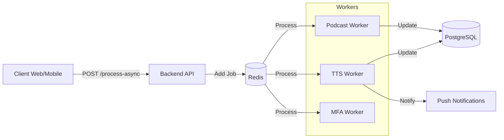

# LingRoot Queue & worker Architecture

> **Oluşturulma:** 2026-01-15 | **Versiyon:** 1.1

## 1. Genel Mimari

LingRoot backend, uzun süren işlemleri (TTS, Podcast oluşturma, AI analizi) asenkron olarak işlemek için **Redis** tabanlı bir kuyruk sistemi (**BullMQ**) kullanır. Bu yapı, sunucu yeniden başlatılsa bile işlerin kaybolmamasını (persistence), hatalarda otomatik tekrar denenmesini (retry) ve öncelik yönetimini (priority) sağlar.



## 2. Queue Yapısı

Sistemde şu an 3 ana queue tanımlıdır:

| Queue Name | Amaç | Concurrency |
|------------|------|-------------|
| `tts-processing` | Metni sese çevirme, chunking, sentezleme | 50 (max) |
| `podcast-processing` | Diyalog tabanlı podcast üretimi | 20 (max) |
| `mfa-alignment` | Ses ile metin hizalama (Sözcük zamanlaması) | 10 (max) |

### 2.1 Job Options

Varsayılan job ayarları:

```javascript
const defaultJobOptions = {
    attempts: 3,             // Hata durumunda 3 kez dene
    backoff: {
        type: 'exponential', // Her denemede bekleme süresi artar (5s, 10s...)
        delay: 5000
    },
    removeOnComplete: { count: 100 }, // Son 100 tamamlanan işi sakla
    removeOnFail: { count: 500 },     // Son 500 hatalı işi sakla (debug için)
    priority: 10                      // Varsayılan: Free User
};
```

## 3. Priority Sistemi

Kullanıcıların abonelik planına göre işlere öncelik verilir. Düşük numara = Yüksek öncelik.

| Plan | Priority Değeri | Açıklama |
|------|-----------------|----------|
| `premium_yearly` | 1-2 | En yüksek öncelik. Kuyruğun önüne geçer. |
| `premium_monthly` | 3 | Yüksek öncelik. |
| `basic` | 5 | Orta öncelik. |
| `free_trial` | 8 | Deneme kullanıcıları. |
| `free` | 10 | En düşük öncelik. Kaynaklar boşsa işlenir. |

## 4. Fallback Mode (Redis Kesintisi)

Redis bağlantısı koparsa veya Redis server ayakta değilse, sistem otomatik olarak **In-Memory** fallback moduna geçer.

- **Kısıtlamalar:**
  - Persistence yoktur (Sunucu kapanırsa işler kaybolur).
  - Dashboard çalışmaz.
  - Priority garantisi yoktur.
  - Sadece basit job processing desteği sağlanır.

## 5. Monitoring & Alerting

### Health Check
- Her 5 dakikada bir kuyruk durumu kontrol edilir.
- `api/admin/metrics/health` endpointi Redis durumunu raporlar.

### Alerts (Slack)
- **Queue Backlog:** Bekleyen iş sayısı > 100 (Uyarı) veya > 500 (Kritik).
- **High Failure Rate:** Hatalı iş sayısı > 50 olduğunda bildirim gönderilir.

### Admin Dashboard (Bull Board)
- Adres: `/api/admin/queues`
- Erişim: Admin yetkisi gerektirir.
- İşlev: Kuyrukları izleme, pause/resume, retry failed jobs.

## 6. Worker Implementasyonu

Her worker izole bir süreçte veya process içinde çalışır. İş mantığı `server.js` üzerinden enjekte edilir (Dependency Injection), böylece worker kodları business logic'ten bağımsız kalır.

**Örnek Worker Başlatma (server.js):**

```javascript
initTtsWorker(async (data, jobInfo) => {
    // İş mantığı burada çalışır
    // Controller fonksiyonunu çağırır
    return await handleTTSRequest(mockReq, mockRes);
});
```
